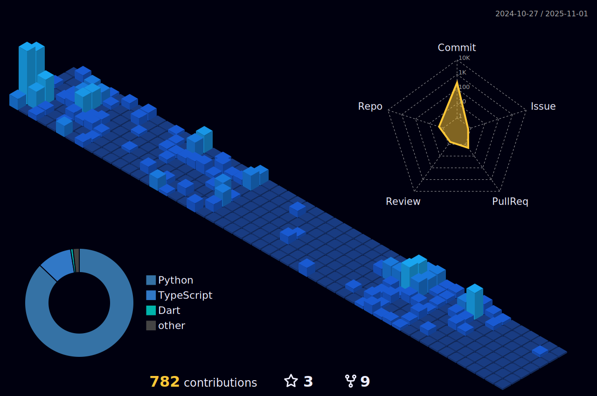

.png)
[](https://twitter.com/SatyakiDey_75)
[](https://www.linkedin.com/in/satyaki-dey-3a0548257/)
[](https://www.instagram.com/satyaki_75/)
[](https://satyaki-dey.vercel.app/)


# Hallo alle zusammen !

<a href="https://github.com/SatyakiDey75?tab=followers"></a>
<a href ="https://metrics.lecoq.io/insights/SatyakiDey75"></a>


```c
Name = "Satyaki Dey"
Interests = ["Coding", "Problem Solving", "Machine Learning", "Cloud Technologies", "App Development"]
Languages = ["C", "Java", "Python", "HTML", "CSS", "Javascript (Node JS)", "React JS", "Dart"]
Frameworks/Libraries: ["Redux", "Express", "Tailwind CSS", "Flutter"]
Cloud/Databases: ["Google Cloud", "MongoDB", "Firestore"]
OS = ["Ubuntu", "Windows", "Debian"]
```

## 💻 My Workstation


##
## 🎷🎶 What I'm Listening To:

<div align=center>
  
[](https://github.com/kittinan/spotify-github-profile)

</div>

##
### Tech Stack:
<div align=center>  


</div>

##
### Connect with me:
<div align=center>
<a href="https://www.linkedin.com/in/satyaki-dey-3a0548257/" alt="Satyaki Dey | LinkedIn"></a> &nbsp;
<a href="https://www.instagram.com/satyaki_75/" alt="satyaki_75 | Instagram"></a> &nbsp;
<a href="https://twitter.com/SatyakiDey_75" alt="Satyaki Dey | Twitter"></a> &nbsp;
<a href="mailto:sdey2836@gmail.com" alt="Satyaki Dey | Gmail"></a> &nbsp;
<a href="https://discordapp.com/users/satyaki75#6354" alt="Satyaki Dey | Discord"></a> &nbsp;
<a href="https://www.hackerrank.com/sdey2836" alt="Satyaki Dey | HackerRank"></a> &nbsp;
<a href="https://leetcode.com" alt="Satyaki Dey | Leetcode"></a> &nbsp;
</div>


##
## 📋 Projects:
- AI Powered Career Counselling: &nbsp;[eDemy](https://edemy-32175.vercel.app)
- Ecommerce Website: &nbsp;[Samarth Ecommerce](https://samarth-ecommerce-42137.vercel.app)
- AI Powered Report Evaluator: &nbsp;[RepX](https://repxai.vercel.app/)
- Smart Exam Preparation using AI: &nbsp;[StudyGenie](https://studygenie-cf.vercel.app/)
- Portfolio Website for an Organization: &nbsp;[Samarth](https://samarth-tmsl.vercel.app)

[Click Here](https://satyaki-dey.vercel.app/projects)  to view more Projects!!


##
### Statistics :  
##
<div align="center">
   <a href="https://github.com/SatyakiDey75">
   
  </a>
   &nbsp;&nbsp;&nbsp;&nbsp;
   <a href="https://github.com/SatyakiDey75">
   
   <br/>
   </a>
   
</div>

<div align=center> 
   &nbsp;&nbsp;
<p></p>


</div>

<!--
### Watch a snake 🐍 eating my contribution graph on Github:
##
<div align=center> 
   
</div>
-->

##
<p><h2 style="text-decoration: none; cursor: none;">📊 <span style="color: #00c2e0">3D View of my Contributions:</span></h2></p>



##
#
<p><h2 style="text-decoration: none; cursor: none;">🏆 <span style="color: #00c2e0">GitHub Trophies:</span></h2></p>


##
#
<p><h2 style="text-decoration: none; cursor: none;">🐍 <span style="color: #00c2e0">Watch a snake eat my contribution graph on Github:</span></h2></p>
<div align=center> 
   <picture>
     <source media="(prefers-color-scheme: dark)" srcset="https://github.com/satyakidey75/satyakidey75/blob/output/github-snake-dark.svg" />
     <source media="(prefers-color-scheme: light)" srcset="https://github.com/satyakidey75/satyakidey75/blob/output/github-snake.svg" />
     
   </picture>
</div>


##
#
<p><h2 style="text-decoration: none; cursor: none;">☄️  <span style="color: #00c2e0">Hacktober Fest 2023:</span></h2></p>


##
#
<p><h2 style="text-decoration: none; cursor: none;">📈  <span style="color: #00c2e0">Github Activity Graph:</span></h2></p>


